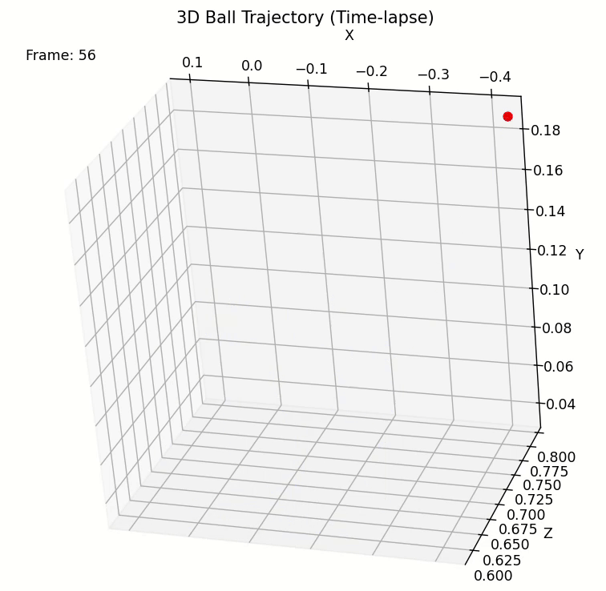

# POVa-ball-tracking in 3D using multiple cameras


This project tracks a ball in 3D space using stereo cameras.
---

## Setup

1. **Clone the repository:**

```bash
git clone <https://github.com/davgal27/3D-object-tracking.git>
cd 3D-object-tracking
```

2. **Create and activate a virtual environment:**

Windows (PowerShell):

PowerShell
```pwsh
python -m venv .env
.\.env\Scripts\Activate.ps1
```
Linux / macOS:

Bash
```bash
python3 -m venv .env
source .env/bin/activate
```
3. **Install dependencies:**

```bash
pip install -r requirements.txt
```

**`requirements.txt` contents:**

```
numpy>=1.26
opencv-python>=4.8
matplotlib>=3.8
pypylon>=2.1
```

---

## How to Run

The workflow consists of three main steps (after calibration):

1. **Detection**  
   Run the detection script to process video frames and extract 3D ball coordinates:

```bash
python src/detection.py
```

2. **Plotting**  
   Visualize the detected coordinates in a static plot:

```bash
python src/plot_xyz.py
```

3. **Animation**  
   Animate the tracked ball trajectory:

```bash
python src/animate_plot.py
```
